# Multi-Platform Invoice Intake as Backend-First UiPath Maestro Case

Track 1 pilot for invoice intake into Qoyod and ERPNext without IXP or RPA runtime dependency.

- Phone PWA captures QR plus one or many invoice photos/PDFs as a batch.
- Express API stores job state, uploads files to Orchestrator Storage, creates `InvoiceIntake` queue items, and can start one Maestro Case per uploaded batch once CaseManagement runtime is available.
- Extraction runs through a modular backend worker: OpenAI vision/PDF first, DeepSeek JSON normalization second when configured.
- Finance review remains human-controlled in the PWA with batch filtering, reusable local mapping rules, and per-invoice release to one or more destinations.
- Qoyod fill is handled by a desktop Chrome extension using the user's logged-in Qoyod browser session. It saves draft only after explicit confirmation.
- ERPNext posting is handled through Frappe REST APIs. It creates Purchase Invoice drafts and attaches the source invoice image/PDF; v1 never submits accounting entries.

---

**Jump to:** [System Architecture](#system-architecture) · [Run Locally](#run-locally) · [HTTPS Tunnels](#temporary-https-tunnels) · [Local Env](#local-env) · [UiPath Resources](#uipath-resources) · [ERPNext](#erpnext-destination) · [API Endpoints](#api-endpoints) · [Chrome Extension](#chrome-extension) · [Current Blockers](#current-blockers) · [Verify](#verify)

---

## System Architecture

The system is built on a **three-layer architecture** with UiPath Maestro as the state machine orchestrator, API Workflows as thin polling messengers, and an Express server as the worker that does all the real work.

###  Architecture

This graph captures every component, every API route, every Maestro task, and every data flow in the production system.

```mermaid
%%{init: {"theme": "neutral", "themeVariables": {"fontSize": "13px", "primaryColor": "#4f8cff"}}}%%
flowchart TB
    subgraph External["🌐 External Actors"]
        PWA["📱 Phone PWA\nInvoice photo/PDF capture\nQR TLV scan"]
        FINANCE["👤 Finance User\nReview & approve/reject"]
        EXCEPTION["👤 Exception Handler\nResolve failures"]
        QOYOD_SITE["🌍 Qoyod.com\nBill creation page"]
    end

    subgraph IntakeAPI["🖥️ Backend API (Express)"]
        direction TB
        API_CAPTURE["POST /api/captures\nSingle invoice upload"]
        API_BATCH["POST /api/batches\nBatch upload (≤50 files)"]
        API_BATCH_GET["GET /api/batches/:batchId"]
        API_BATCH_LIST["GET /api/batches"]
        API_BULK_REVIEW["POST /api/batches/:batchId/bulk-review"]

        API_CASE_PROGRESS["GET /api/case/batches/:batchId/progress"]
        API_CASE_STAGE["POST /api/case/batches/:batchId/stage"]
        API_CASE_EXCEPTION["POST /api/case/batches/:batchId/exception"]
        API_CASE_CLOSE["POST /api/case/batches/:batchId/close"]
        API_CASE_EXTRACTION["POST /api/case/batches/:batchId/extraction/start"]
        API_CASE_TASK["POST /api/case/batches/:batchId/task"]

        API_EXTRACT_START["POST /api/extraction/jobs/:jobId/start"]
        API_EXTRACT_RESULT["POST /api/extraction/jobs/:jobId/result"]
        API_REVIEW["POST /api/jobs/:jobId/review"]
        API_DEST_POST["POST /api/jobs/:jobId/destinations/:platform/post"]
        API_DESTINATIONS["GET /api/destinations"]

        API_FILL_CLAIM["POST /api/fill/jobs/claim-next"]
        API_FILL_STATUS["POST /api/fill/jobs/:jobId/status"]
        API_FILL_SOURCE["GET /api/fill/jobs/:jobId/source"]

        API_MAPPINGS["GET /api/mappings\nPOST /api/mappings\nDELETE /api/mappings/:ruleId"]
        API_APPLY_MAPPINGS["POST /api/batches/:batchId/apply-mappings"]
        API_ERP_PREFLIGHT["GET /api/destinations/erpnext/preflight"]
    end

    subgraph MaestroCase["📋 UiPath Maestro Case"]
        direction TB
        MC_TRIGGER["Trigger\nStart Invoice Batch Intake"]

        MC_STAGE1["Stage 1: Capture Intake\nRegister Capture Payload"]
        MC_STAGE2["Stage 2: Extraction &\nReconciliation"]
        MC_STAGE3["Stage 3: Finance Review\n& Mapping"]
        MC_STAGE4["Stage 4: Destination\nPosting"]
        MC_STAGE5["Stage 5: Qoyod\nDrafting"]
        MC_EXCEPTION["Stage 6: Exception\nResolution"]
        MC_CLOSED["Stage 7: Closed\nRecord Case Closure"]

        MC_TRIGGER -->|Entered| MC_STAGE1
        MC_STAGE1 -->|Completed| MC_STAGE2
        MC_STAGE2 -->|no error| MC_STAGE3
        MC_STAGE2 -->|has error| MC_EXCEPTION
        MC_STAGE3 -->|approved| MC_STAGE4
        MC_STAGE3 -->|rejected| MC_CLOSED
        MC_STAGE3 -->|error| MC_EXCEPTION
        MC_STAGE4 -->|Qoyod next| MC_STAGE5
        MC_STAGE4 -->|closed| MC_CLOSED
        MC_STAGE4 -->|error| MC_EXCEPTION
        MC_STAGE5 -->|draft saved| MC_CLOSED
        MC_STAGE5 -->|error| MC_EXCEPTION
        MC_EXCEPTION -->|resolved| MC_CLOSED
    end

    subgraph ApiWorkflows["⚡ API Workflow Definitions"]
        direction TB
        AW_REGISTER["RegisterCapturePayload\nPOST → /api/case/batches/{id}/stage"]
        AW_EXTRACTION["StartAndWaitExtraction\nPOST → start + poll progress\nuntil complete/error/timeout"]
        AW_POSTING["PersistReviewAndWaitPosting\nPoll progress for ERPNext\nposting completion"]
        AW_QOYOD["WaitForQoyodExtensionDraft\nPoll progress for Qoyod\ndraft save completion"]
        AW_CLOSURE["RecordCaseClosure\nPOST → /api/case/batches/{id}/close"]
    end

    subgraph DataStore["💾 Data Store"]
        JOB_STORE["Job Store\nIn-memory Map"]
        UPLOAD_DIR["Upload Directory\nLocal filesystem"]
        MAPPING_RULES["Mapping Rules\nSupplier→Item/Expense"]
    end

    subgraph UiPathCLI["🔌 UiPath Orchestrator CLI"]
        UIP_BUCKET["or bucket-files upload\nAttachments to bucket"]
        UIP_QUEUE["or queue-items add\nInvoiceIntake queue"]
        UIP_CASE["uip maestro case process run\nStart Maestro Case"]
    end

    subgraph LLM["🧠 LLM Extraction"]
        direction LR
        OPENAI["OpenAI GPT"]
        DEEPSEEK["DeepSeek"]
        EXTERNAL["External Service"]
        MOCK["Mock (dev only)"]
    end

    subgraph Reconciliation["✅ Reconciliation Engine"]
        RECON["reconcileDraft()\nQR ↔ OCR validation\nRequired fields\nDuplicate check\nConfidence scoring"]
    end

    subgraph Mappings["🔗 Auto-Mapping Engine"]
        MAP_ENGINE["applyMappingRules()\nSupplier + text matching\nScoring & ranking"]
    end

    subgraph Destinations["📤 Destination Posting"]
        EN_POST["ERPNext Post Engine\ncreateErpNextPurchaseInvoiceDraft()"]
        EN_PREFLIGHT["ERPNext Preflight\nSupplier + Item validation"]
    end

    subgraph ChromeExtension["🧩 Chrome Extension (Qoyod Filler)"]
        direction TB
        SP_SIDEPANEL["Side Panel\nClaim, Fill, Save Draft"]
        SP_CONTENT["Content Script\nDOM manipulation"]
        SP_CALIBRATION["Calibration Engine\nLearn CSS selectors"]
        SP_SELECTORS["Selector Profile\nSaved per-user"]
    end

    subgraph QoyodSaaS["📊 Qoyod Accounting"]
        Q_FORM["Bill Creation Form\nVendor, Lines, Tax,\nAttachments"]
        Q_DRAFT["Draft Bills\nSaved, not posted"]
    end

    subgraph WebApp["🌐 Finance Web App (React)"]
        WA_BATCH_VIEW["Batch List View"]
        WA_JOB_VIEW["Invoice Detail View\nEdit draft, mapping,\napprove/reject"]
        WA_MAPPINGS["Mapping Rules Manager\nCRUD for rules"]
        WA_STATUS["Status Dashboard\nJob status, destinations"]
    end

    PWA -->|"POST /api/captures\ndocument + qrPayload"| API_CAPTURE
    PWA -->|"POST /api/batches\ndocuments[] + qrPayloads[]"| API_BATCH

    API_CAPTURE -->|create job| JOB_STORE
    API_BATCH -->|create batch + jobs| JOB_STORE

    API_BATCH -->|start Maestro Case| UIP_CASE
    UIP_CASE -->|caseInstanceId| MC_TRIGGER

    MaestroCase <-->|HTTP callbacks via x-case-token| IntakeAPI

    MC_STAGE1 -->|triggers| AW_REGISTER
    AW_REGISTER -->|POST stage| API_CASE_STAGE
    API_CASE_STAGE -->|update batch| JOB_STORE

    MC_STAGE2 -->|triggers| AW_EXTRACTION
    AW_EXTRACTION -->|POST start| API_CASE_EXTRACTION
    API_CASE_EXTRACTION -->|extract| LLM
    LLM -->|POST result| API_EXTRACT_RESULT
    API_EXTRACT_RESULT -->|validate| RECON
    RECON -->|update job| JOB_STORE
    AW_EXTRACTION -->|GET progress| API_CASE_PROGRESS
    API_CASE_PROGRESS --> JOB_STORE

    MC_STAGE3 -->|triggers| FINANCE
    FINANCE <-->|"Action Center task"| WebApp
    WebApp -->|"POST /api/jobs/:jobId/review"| API_REVIEW
    WebApp -->|"POST /api/batches/:batchId/bulk-review"| API_BULK_REVIEW
    API_REVIEW --> JOB_STORE
    API_BULK_REVIEW --> JOB_STORE

    MC_STAGE4 -->|triggers| AW_POSTING
    AW_POSTING -->|GET progress| API_CASE_PROGRESS
    API_CASE_PROGRESS --> JOB_STORE
    API_BULK_REVIEW -->|auto-post ERPNext| EN_POST
    EN_POST -->|"POST /api/destinations/erpnext/preflight"| EN_PREFLIGHT
    EN_POST -->|create draft| JOB_STORE

    MC_STAGE5 -->|triggers| AW_QOYOD
    AW_QOYOD -->|GET progress| API_CASE_PROGRESS

    SP_SIDEPANEL -->|claim-next| API_FILL_CLAIM
    API_FILL_CLAIM --> JOB_STORE
    SP_SIDEPANEL -->|fill| SP_CONTENT
    SP_CONTENT -->|DOM manipulation| QOYOD_SITE
    QOYOD_SITE --> Q_FORM
    SP_SIDEPANEL -->|save draft| SP_CONTENT
    SP_CONTENT -->|confirm| Q_DRAFT
    SP_SIDEPANEL -->|status update| API_FILL_STATUS
    API_FILL_STATUS --> JOB_STORE
    SP_SIDEPANEL -->|fetch source| API_FILL_SOURCE

    MC_EXCEPTION -->|triggers| EXCEPTION
    EXCEPTION <-->|Action Center| WebApp
    EXCEPTION -->|resolve| API_CASE_EXCEPTION

    MC_CLOSED -->|triggers| AW_CLOSURE
    AW_CLOSURE -->|POST close| API_CASE_CLOSE
    API_CASE_CLOSE -->|mark closed| JOB_STORE

    API_DEST_POST --> EN_POST
    API_ERP_PREFLIGHT --> EN_PREFLIGHT

    API_MAPPINGS <--> MAPPING_RULES
    API_APPLY_MAPPINGS --> MAP_ENGINE
    MAP_ENGINE --> MAPPING_RULES

    WA_BATCH_VIEW --> API_BATCH_LIST
    WA_JOB_VIEW --> API_BATCH_GET
    WA_MAPPINGS --> API_MAPPINGS

    UIP_BUCKET -->|upload attachment| JOB_STORE
    UIP_QUEUE -->|queue item| JOB_STORE

    style PWA fill:#c8e6c9,stroke:#388e3c,color:#1b5e20
    style FINANCE fill:#ffe0b2,stroke:#ef6c00,color:#bf360c
    style EXCEPTION fill:#ffccbc,stroke:#d84315,color:#bf360c
    style QOYOD_SITE fill:#b2dfdb,stroke:#00897b,color:#004d40
    style MaestroCase fill:#bbdefb,stroke:#1976d2,color:#0d47a1,stroke-width:2px
    style IntakeAPI fill:#e3f2fd,stroke:#1565c0,color:#0d47a1
    style ApiWorkflows fill:#e8eaf6,stroke:#3949ab,color:#1a237e
    style LLM fill:#e1bee7,stroke:#7b1fa2,color:#4a148c
    style ChromeExtension fill:#d1c4e9,stroke:#5e35b1,color:#311b92
    style WebApp fill:#fff9c4,stroke:#fdd835,color:#f57f17
    style Destinations fill:#f8bbd0,stroke:#c2185b,color:#880e4f
```



### Stage-by-Stage Data Flow

| Stage | Maestro Task | API Workflow | What Happens |
|---|---|---|---|
| **Capture Intake** | `RegisterCapturePayload` | `QoyodCaseRegisterCapturePayload` | Records batch → `POST /api/case/batches/{id}/stage` |
| **Extraction & Reconciliation** | `StartAndWaitExtraction` | `QoyodCaseStartAndWaitExtraction` | Starts LLM extraction, polls `GET /progress`, runs QR↔OCR reconciliation |
| **Finance Review & Mapping** | `ReviewCorrectAndMapInvoice` | Action Center task | Human reviews in web app, corrects fields, approves destinations |
| **Destination Posting** | `PersistReviewAndWaitPosting` | `QoyodCasePersistReviewAndWaitPosting` | Polls for ERPNext draft completion (auto-created via API) |
| **Qoyod Drafting** | `WaitForQoyodExtensionDraftSave` | `QoyodCaseWaitForQoyodExtensionDraft` | Polls for Chrome extension to save draft in Qoyod |
| **Exception Resolution** | `ResolveInvoiceIntakeException` | Action Center task | Human resolves rejections/failures, can re-route or close |
| **Closed** | `RecordCaseClosure` | `QoyodCaseRecordCaseClosure` | Final `POST /api/case/batches/{id}/close` notifies backend |

### Exception Routing

| Error Source | Condition | Routes To |
|---|---|---|
| Extraction | `errorCode !== ''` after extraction | Exception Resolution |
| Finance review | `reviewDecision === 'rejected'` or `errorCode !== ''` | Exception Resolution |
| Destination posting | `errorCode !== ''` after ERPNext | Exception Resolution |
| Qoyod drafting | `errorCode !== ''` after extension fill | Exception Resolution |
| Manual | User selects exception stage manually | Exception Resolution |

### Closing Paths

1. **Happy path:** Capture → Extraction → Review → ERPNext → Qoyod Draft → **Closed**
2. **Rejection:** Capture → Extraction → Review (reject) → **Closed**
3. **Exception resolved:** Capture → Extraction → Exception → **Closed**
4. **ERPNext-only:** Capture → Extraction → Review → ERPNext → **Closed** (skips Qoyod)

---

## Run Locally

```powershell
npm install
npm run dev
```

Open `http://localhost:5173`. The API runs on `http://localhost:8787`.

For the complete operator walkthrough, see [`docs/USER_GUIDE.md`](docs/USER_GUIDE.md).

## Temporary HTTPS Tunnels

Use this when Maestro needs to call the local API or when testing the PWA from a phone without publishing the app.

Start the local app first:

```powershell
npm run dev
```

Then start both HTTPS tunnels:

```powershell
powershell -ExecutionPolicy Bypass -File scripts\dev-tunnels.ps1 start -SyncMaestro
```

The script creates:

- API tunnel for `http://localhost:8787`, used by Maestro callbacks and `PUBLIC_API_BASE_URL`.
- Web tunnel for `http://localhost:5173`, opened on the phone for capture/review testing and used by Action Center review links through `PUBLIC_WEB_APP_URL`.

Check current tunnel URLs:

```powershell
powershell -ExecutionPolicy Bypass -File scripts\dev-tunnels.ps1 status
```

Stop both tunnels:

```powershell
powershell -ExecutionPolicy Bypass -File scripts\dev-tunnels.ps1 stop
```

This closes the public HTTPS tunnels. To stop the local web/API listeners too, stop `npm run dev` with `Ctrl+C` in its terminal.

The script updates ignored local `.env` with the current API tunnel URL and web tunnel URL, then verifies that the running backend and Maestro preflight see those URLs. Tunnel URLs are temporary; restart tunnels and rerun sync before each live Maestro demo.

If you started tunnels without `-SyncMaestro`, run:

```powershell
powershell -ExecutionPolicy Bypass -File scripts\sync-maestro-tunnel.ps1
```

Run a live Case callback smoke test:

```powershell
powershell -ExecutionPolicy Bypass -File scripts\maestro-tunnel-smoke.ps1 -BatchName "demo test"
```

Tunnel rotation does not require redeploying the UiPath package because the current tunnel URL is passed as a Case start input. See `docs/MAESTRO_TUNNEL_ROTATION_FINDINGS.md` for the root cause and recovery details.

## Local Env

Copy `.env.example` and set the local secrets you have:

```powershell
$env:PUBLIC_API_BASE_URL="http://localhost:8787"
$env:PUBLIC_WEB_APP_URL="http://localhost:5173"
$env:EXTRACTION_MODE="local"
$env:OPENAI_API_KEY="<openai-key>"
$env:OPENAI_EXTRACTION_MODEL="gpt-4.1"
$env:DEEPSEEK_API_KEY="<deepseek-key>"
$env:DEEPSEEK_MODEL="deepseek-v4-flash"
$env:FILLER_API_TOKEN="<shared-extension-token>"
$env:INVOICE_DESTINATIONS="qoyod,erpnext"
$env:ERPNEXT_BASE_URL="https://your-sandbox.example"
$env:ERPNEXT_API_KEY="<api-key>"
$env:ERPNEXT_API_SECRET="<api-secret>"
$env:ERPNEXT_COMPANY="<company>"
$env:ERPNEXT_DEFAULT_EXPENSE_ACCOUNT="<expense-account>"
$env:ERPNEXT_DEFAULT_COST_CENTER="<cost-center>"
```

Use `EXTRACTION_MODE=external` plus `EXTRACTION_START_URL` when extraction moves to a separate backend. Cloud Maestro cannot call localhost, so Case-driven execution needs `PUBLIC_API_BASE_URL` to be a public HTTPS URL. Action Center review links also need `PUBLIC_WEB_APP_URL` to be a public HTTPS URL when reviewers are outside the local browser.

## UiPath Resources

Configure these per tenant in your local `.env`; no connected environment values are committed.

- Base URL: your UiPath Automation Cloud URL
- Organization: your organization name
- Tenant: your tenant name
- Folder: your target folder path
- Folder key: your target folder key
- Queue: `InvoiceIntake`
- Storage bucket: your invoice-intake storage bucket
- Case solution: `uipath/QoyodInvoiceIntakeSolution`
- Case file: `uipath/QoyodInvoiceIntakeSolution/QoyodInvoiceIntakeCase/caseplan.json`

The Case remains the visible Maestro design. In live mode, API Workflow tasks call the backend to start extraction, poll review/post/fill state, and record stage callbacks. If CaseManagement runtime is not available in your tenant, the PWA shows a local Maestro Case cockpit that mirrors the same stages.

Run the read-only preflight before a demo:

```powershell
powershell -ExecutionPolicy Bypass -File scripts\maestro-preflight.ps1
```

## ERPNext Destination

Configure ERPNext against a sandbox/staging site first. Required values:

- `ERPNEXT_BASE_URL`
- `ERPNEXT_API_KEY`
- `ERPNEXT_API_SECRET`
- `ERPNEXT_COMPANY`
- `ERPNEXT_DEFAULT_EXPENSE_ACCOUNT`
- `ERPNEXT_DEFAULT_COST_CENTER`

Optional values:

- `ERPNEXT_DEFAULT_ITEM_CODE` for sites that require an item code on every Purchase Invoice row.
- `ERPNEXT_PURCHASE_TAXES_AND_CHARGES_TEMPLATE` or `ERPNEXT_VAT_ACCOUNT_HEAD` for tax handling.
- `ERPNEXT_TEST_SUPPLIER` for live smoke tests.

`ERPNEXT_SUBMIT_AFTER_POST` must stay `false` in v1. ERPNext output is a draft Purchase Invoice plus the uploaded source attachment.

Run live sandbox validation explicitly:

```powershell
$env:LIVE_ERPNEXT_TEST="true"
$env:LIVE_UIPATH_TEST="true"
$env:ERPNEXT_TEST_SUPPLIER="<existing-sandbox-supplier>"
npm run smoke:live
```

The ERPNext smoke test creates a uniquely numbered `UIPATH-TEST-<timestamp>` draft and leaves it in the sandbox for manual inspection.

## API Endpoints

Capture and review:

```http
POST /api/captures
POST /api/batches
GET /api/batches
GET /api/batches/{batchId}
POST /api/batches/{batchId}/apply-mappings
POST /api/batches/{batchId}/bulk-review
GET /api/jobs/{jobId}
POST /api/jobs/{jobId}/review
GET /api/mappings
POST /api/mappings
DELETE /api/mappings/{ruleId}
```

Extraction:

```http
POST /api/extraction/jobs/{jobId}/start
GET /api/extraction/jobs/{jobId}/input
GET /api/extraction/jobs/{jobId}/source
POST /api/extraction/jobs/{jobId}/result
```

Qoyod extension fill:

```http
POST /api/fill/jobs/claim-next
GET /api/fill/jobs/{jobId}
GET /api/fill/jobs/{jobId}/source
POST /api/fill/jobs/{jobId}/status
```

Destinations:

```http
GET /api/destinations
GET /api/destinations/erpnext/preflight
POST /api/jobs/{jobId}/destinations/erpnext/post
POST /api/case/jobs/{jobId}/destinations/erpnext/post
```

Maestro Case callbacks:

```http
GET /api/runtime/config
GET /api/case/batches/{batchId}
POST /api/case/batches/{batchId}/stage
POST /api/case/batches/{batchId}/task
POST /api/case/batches/{batchId}/exception
POST /api/case/batches/{batchId}/close
POST /api/case/jobs/{jobId}/extraction
POST /api/case/jobs/{jobId}/review
POST /api/case/jobs/{jobId}/exception
```

Deprecated `/api/robot/...` aliases remain for compatibility, but new work should use `/api/fill/...`.

## Chrome Extension

Load `extension/qoyod-filler` as an unpacked Chrome extension:

1. Open `chrome://extensions`.
2. Enable Developer mode.
3. Load unpacked and select `extension/qoyod-filler`.
4. Log into Qoyod in Chrome and open the draft form.
5. Click the extension toolbar icon to open the side panel.
6. Configure API base URL and fill token in the side panel.
7. Optionally select a batch scope, then claim, fill, review, and save draft sequentially.

The extension never stores Qoyod credentials and never clicks approve/submit.

## Current Blockers

- No IXP access: extraction is LLM-backed.
- No RPA license/runtime: Qoyod fill is extension-assisted.
- No Qoyod API access: the extension uses the logged-in browser session.
- No CaseManagement runtime in staging: backend-first execution is active until runtime is allocated.
- ERPNext requires existing sandbox master data: Supplier, Company, Account, Cost Center, and tax/item setup as configured.

## Verify

```powershell
npm test
npm run build
npm run smoke:live
npm audit --audit-level=low
powershell -ExecutionPolicy Bypass -File scripts\maestro-preflight.ps1
uip maestro case validate uipath/QoyodInvoiceIntakeSolution/QoyodInvoiceIntakeCase/caseplan.json --output json
```
