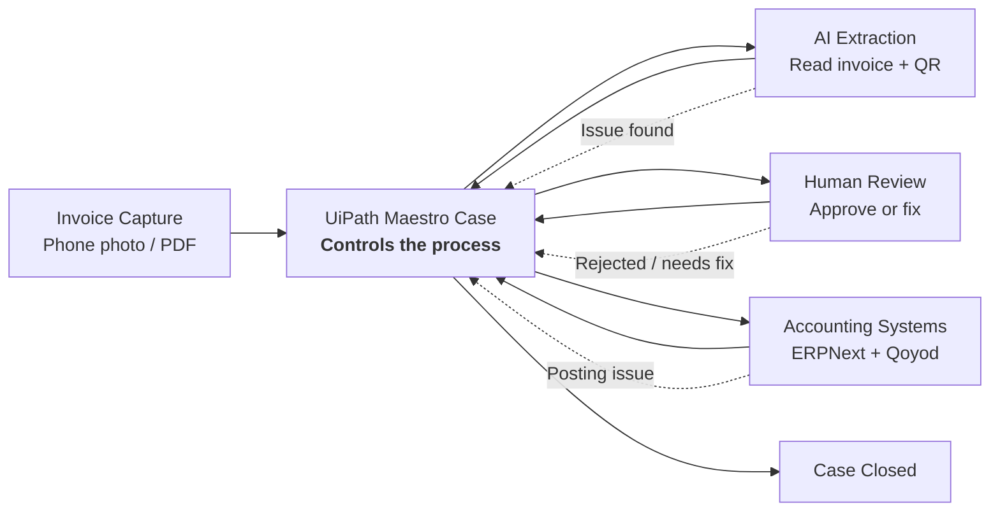

# Fatoorah AI

**Capture invoices. Extract the data. Let Maestro control the whole case.**

[Overview](#overview) · [Demo flow](#demo-flow) · [Architecture](#architecture) · [Repository guides](#repository-guides) · [Key features](#key-features) · [Tech stack](#tech-stack) · [Local development](#local-development) · [Vision](#vision)

Fatoorah AI is an AI-powered invoice intake system built for Saudi and Gulf businesses. It takes a phone photo or PDF of an invoice, extracts the important fields, checks the math, validates VAT totals, and prepares the invoice for human review before it goes into accounting systems like Qoyod and ERPNext.

The goal is simple:

> No more copying invoice data by hand.  
> No more typing vendor names, VAT numbers, invoice totals, and line items one by one.  
> Just capture, extract, review, and release.

---

## Overview

Finance teams still waste hours every week manually entering invoice data into accounting software.

That workflow is slow, boring, and easy to break:

- One typo can create wrong VAT records.
- One missing invoice line can cause reconciliation issues.
- One bad total can create compliance problems.
- And every invoice steals a few more minutes from someone’s day.

Fatoorah AI turns that painful manual flow into an assisted automation pipeline.

It does not blindly submit invoices. It extracts, validates, routes exceptions, and prepares drafts so a human can stay in control before anything becomes official.

---

## What it does

Fatoorah AI handles the full invoice intake journey:

1. Capture an invoice from a phone, browser, or local upload.
2. Extract vendor details, VAT number, invoice number, totals, QR data, and line items.
3. Validate the math between line items, VAT, and final total.
4. Flag mismatches before they reach the accounting system.
5. Route the case through UiPath Maestro.
6. Let a human approve, reject, or fix the invoice.
7. Send the clean invoice data into Qoyod, ERPNext, or another destination as a draft.

---

## Demo flow

```text
Invoice photo / PDF
        ↓
UiPath Maestro Case
        ↓
AI extraction + QR reading
        ↓
Invoice math + VAT validation
        ↓
Human review
        ↓
Qoyod / ERPNext draft
        ↓
Case closed
```

A user can take a photo of an invoice, review the extracted result, and push it toward the accounting system without manually retyping everything.

---

## Architecture

At a high level, UiPath Maestro is the center of the workflow. It controls the case, calls the AI extraction service, sends the invoice for human review, handles rejection or fixes, and coordinates posting into accounting systems.



---

## Repository guides

This repo has two main parts.

### 1. Extraction backend

Read: [`extraction/README.md`](extraction/README.md)

The extraction service is a Django backend that receives invoice files, sends them to the AI extraction layer, saves the structured result, validates invoice totals, and exposes a review dashboard.

Use this if you want to understand or run the invoice extraction engine.

### 2. UiPath automation layer

Read: [`uipath-automation/README.md`](uipath-automation/README.md)

The automation layer contains the PWA, local API, Maestro case resources, Qoyod browser filler, ERPNext integration, tunneling scripts, and demo workflow.

Use this if you want to run the full automation experience.

---

## Key features

### AI invoice extraction

Reads invoice images and PDFs, including real-world invoice photos, and converts them into structured invoice data.

Extracted fields include:

- Seller name
- VAT / tax number
- Invoice number
- Invoice timestamp
- Subtotal
- VAT amount
- Total with VAT
- QR data
- Line items

### Invoice math validation

Fatoorah AI does not only extract data. It checks whether the invoice makes sense.

It calculates:

```text
computed total = sum(quantity × unit price) + VAT amount
```

Then it compares that number against the extracted total with VAT.

If the difference is small, the invoice is marked as a match.  
If the numbers do not add up, the invoice is flagged for review.

### Maestro-controlled case flow

UiPath Maestro is the control layer.

It keeps the invoice moving through the right stages:

- Capture received
- Extraction completed
- Validation passed or failed
- Human review needed
- Accounting draft prepared
- Case closed

This makes the demo feel less like a simple script and more like a real business process with state, routing, exceptions, and human approval.

### Human-controlled automation

The system is designed around safe automation.

Fatoorah AI can prepare the invoice, fill fields, and create drafts, but the human reviewer keeps the final decision.

This is especially important for finance workflows where blindly submitting data is risky.

### Qoyod and ERPNext ready

The project supports two accounting destinations:

- Qoyod through a browser-based filling flow.
- ERPNext through Frappe REST APIs.

Both are treated as draft-first destinations in the current version.

---

## Project structure

```text
Fatoorah-AI/
├── README.md
├── extraction/
│   ├── README.md
│   ├── manage.py
│   ├── invoice_backend/
│   ├── invoices/
│   ├── templates/
│   └── KSA_Real_Invoices/
│
└── uipath-automation/
    ├── README.md
    ├── src/
    ├── extension/
    ├── scripts/
    ├── docs/
    └── uipath/
```

---

## Tech stack

### Extraction

- Python
- Django
- Django REST Framework
- Google Gemini
- SQLite for local development
- PostgreSQL-ready configuration

### Automation

- TypeScript
- Node.js
- Vite
- PWA frontend
- Chrome Extension
- UiPath Maestro case resources
- ERPNext / Frappe REST API integration

---

## Local development

Start with the part you want to run.

For the extraction backend:

```text
extraction/README.md
```

For the automation app:

```text
uipath-automation/README.md
```

Each folder has its own setup because the backend and automation layer can be developed independently.

---

## Current status

Fatoorah AI is built as a working hackathon-grade product prototype.

It already includes:

- Real invoice image samples.
- A Django extraction backend.
- Invoice database models.
- Validation logic.
- Dashboard view.
- PWA capture and review flow.
- Qoyod browser filler.
- ERPNext draft posting.
- UiPath Maestro case assets.

The next step is making the demo smoother, improving extraction accuracy on more invoice formats, and hardening the accounting integrations.

---

## Vision

Fatoorah AI is not just “OCR for invoices.”

The bigger idea is an accounting automation assistant for small and mid-sized businesses in the Gulf.

A business owner or accountant should be able to take a picture of an invoice and have the system prepare everything:

- Extract the data.
- Read the QR.
- Check the totals.
- Detect suspicious mismatches.
- Route exceptions through Maestro.
- Prepare the accounting draft.
- Keep the human in control.

That is the future this project is moving toward.
